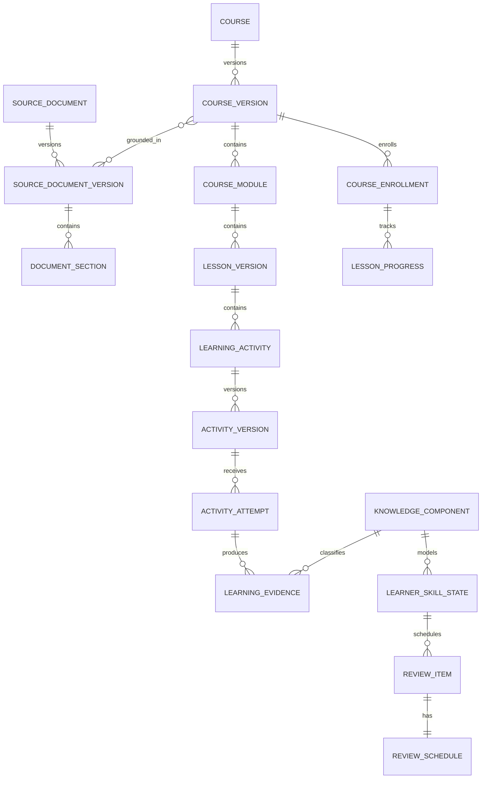

# ZuniBee 2.0 — Product Transformation Blueprint

> **Trạng thái:** Product/UX/AI/Architecture North Star  
> **Thời hạn thiết kế:** 5–10 năm  
> **Ngày:** 16/07/2026  
> **Phạm vi:** Thiết kế sản phẩm, không phải đặc tả để viết toàn bộ hệ thống trong một lần  
> **Nguyên tắc bắt buộc:** Không rewrite; mở rộng dần từ hệ thống ZuniBee hiện tại

## Tóm tắt quyết định điều hành

ZuniBee 2.0 không còn lấy `Quiz` làm đơn vị trung tâm. Trục sản phẩm và dữ liệu mới là:

```text
Nguồn thật → Khóa học có cấu trúc → Bài học ngắn → Hoạt động học
          → Bằng chứng học tập → Mức độ thành thạo → Kế hoạch tiếp theo
```

Năm quyết định quan trọng nhất:

1. **Điểm vào thị trường:** biến tài liệu tiếng Anh thực tế thành lộ trình học cá nhân hóa, có nguồn và có cấu trúc; không xây một chatbot hoặc LMS tổng quát.
2. **Đơn vị giá trị:** một phiên học 5–10 phút tạo ra tiến bộ có thể đo được, không phải một lần gọi AI hay một quiz được sinh.
3. **Trải nghiệm chính:** Student mở ứng dụng và nhận được một hành động rõ ràng — **“Học ngay kế hoạch hôm nay”**.
4. **Kiến trúc:** tiếp tục modular monolith NestJS/PostgreSQL/Redis, bổ sung bounded context và event/outbox; chỉ tách service khi có bằng chứng vận hành.
5. **Cách di chuyển:** giữ nguyên Auth, Classroom, Quiz, AI provider, document processing, credits, usage và notification; bọc chúng bằng các abstraction mới rồi chuyển dần theo mô hình strangler.

### Product North Star

**Weekly Mastery Learners (WML):** số người học trong tuần hoàn thành ít nhất 3 phiên học có bằng chứng tiến bộ về một hoặc nhiều kỹ năng.

Một phiên chỉ được tính là “meaningful” khi có ít nhất một trong các bằng chứng:

- hoàn thành lesson và đạt mastery threshold;
- recall thành công một review item đã đến hạn;
- sửa được lỗi cũ trong ngữ cảnh mới;
- hoàn thành speaking/writing task và xử lý feedback;
- vượt checkpoint sau một chuỗi practice, không chỉ mở màn hình hay nhận XP.

North Star này buộc sản phẩm tối ưu cho học thật. AI output, số tài liệu upload, số quiz tạo và thời gian trong app chỉ là chỉ số đầu vào.

### Giả định chiến lược cần kiểm chứng

- Thị trường đầu tiên là người Việt học tiếng Anh và giáo viên/giảng viên tiếng Anh tại Việt Nam.
- Wedge ban đầu là tài liệu vocabulary, grammar, collocation, IELTS và TOEIC có cấu trúc tương đối rõ.
- Marketplace và Organization là động cơ tăng trưởng sau khi Learning Runtime và chất lượng khóa học đã được chứng minh.
- Giới hạn gói và mức giá bên dưới là khung entitlement; con số cụ thể phải được chốt bằng dữ liệu cost/retention, không hard-code vào sản phẩm.

---

## 1. Product Vision

### Tầm nhìn

> **ZuniBee biến bất kỳ tài liệu tiếng Anh đáng tin cậy nào thành một hành trình học hằng ngày, có cấu trúc, có hướng dẫn và thích ứng theo từng người.**

Trong 5–10 năm, ZuniBee trở thành lớp “learning intelligence” nằm giữa nguồn tri thức và người học:

- hiểu cấu trúc và mục đích sư phạm của tài liệu;
- biến nội dung dài thành curriculum và micro-lessons;
- quan sát bằng chứng học tập qua nhiều loại hoạt động;
- lập kế hoạch tiếp theo theo mức độ thành thạo và khả năng quên;
- cho phép giáo viên kiểm soát, chỉnh sửa và xuất bản;
- giải thích được vì sao hệ thống đề xuất một bài học hoặc một lần ôn.

### Lời hứa sản phẩm

**Cho người học:** “Mỗi ngày mở ZuniBee, bạn biết mình nên học gì trong 5–10 phút và vì sao.”

**Cho giáo viên:** “Biến tài liệu thành khóa học có thể kiểm soát trong vài giờ thay vì nhiều tuần, nhưng quyền quyết định sư phạm vẫn thuộc về bạn.”

### Các nguyên tắc không thỏa hiệp

1. **Learning outcome trước AI novelty.** Tính năng chỉ tồn tại khi cải thiện khả năng hiểu, vận dụng, ghi nhớ hoặc động lực học.
2. **Grounded by source.** Nội dung sinh từ tài liệu phải truy vết được đến section/page/slide; phần AI bổ sung phải được gắn nhãn.
3. **Learner agency.** Cá nhân hóa đưa ra lý do và cho phép đổi mục tiêu, cường độ hoặc bỏ qua; không biến thành hộp đen cưỡng ép.
4. **Teacher in control.** AI tạo bản nháp; giáo viên là người review/publish với các khóa học chính thức.
5. **Progressive generation.** Không chờ sinh toàn bộ khóa học. Outline và module đầu xuất hiện trước; lesson/activity được tạo theo nhu cầu và có thể resume.
6. **Mastery before vanity.** XP, streak và badge không thay thế mastery, feedback hay review.
7. **Accessible by default.** Mục tiêu tối thiểu WCAG 2.2 AA cho toàn bộ learner runtime và authoring surfaces.
8. **Version everything important.** Source, course, lesson, activity, prompt, model, rubric và scheduler đều phải có version/provenance.

### Non-goals trong 24 tháng đầu

- Không trở thành LMS tổng quát có video conference, payroll hoặc school ERP.
- Không tạo social feed mở hoặc cạnh tranh bằng chat tự do vô hạn.
- Không hỗ trợ mọi môn học và mọi loại tài liệu ngay lập tức.
- Không xây marketplace trước khi có quality gate, copyright workflow và learning outcome đáng tin cậy.
- Không tách hàng chục microservice trước khi modular monolith tạo ra bottleneck đo được.

---

## 2. Product Strategy

### Strategic wedge

Nhu cầu không được phục vụ tốt hiện nay là khoảng trống giữa “tôi có tài liệu tốt” và “tôi học tài liệu này đều đặn, đúng trọng tâm và nhớ lâu”. ZuniBee sở hữu toàn bộ vòng lặp đó:

```text
Understand source → Design journey → Deliver practice
→ Observe evidence → Model mastery → Adapt next plan
```

### Năm strategic bets

| Bet                    | Vì sao có giá trị                                  | Cách kiểm chứng sớm                                                |
| ---------------------- | -------------------------------------------------- | ------------------------------------------------------------------ |
| Document Intelligence  | Là khác biệt khó sao chép hơn một prompt sinh quiz | Tỉ lệ outline được giáo viên chấp nhận; coverage/citation accuracy |
| Daily Learning Runtime | Biến công cụ tạo nội dung thành thói quen B2C      | Activation, 3-session week, D7/W4 learning retention               |
| Learner Model          | Tạo cá nhân hóa thực thay vì đổi prompt            | Recall calibration, mastery gain, mistake recurrence               |
| Teacher Course Studio  | Tạo nguồn cung chất lượng và B2B2C                 | Time-to-first-publish, edit/regenerate rate, learner outcome       |
| Trust & Provenance     | Quyết định khả năng bán cho teacher/org            | Source traceability, quality incident rate, audit completeness     |

### Trình tự chiến lược

1. **AI Study Platform:** course shell, lesson runtime, activity framework, Today plan, review cơ bản.
2. **AI English Learning Platform:** CEFR/skill graph, vocabulary/grammar model, listening/speaking/writing, AI Teacher có nguồn.
3. **Teacher & Organization Platform:** collaborative authoring, cohorts, assignment, reporting, entitlement và standards integration.
4. **Marketplace:** discovery, commerce, copyright review, seller analytics và revenue share.
5. **AI Learning Platform:** mở rộng sang môn khác chỉ sau khi domain model tiếng Anh chứng minh khả năng tổng quát hóa.

### Hệ chỉ số

| Tầng        | Chỉ số chính                                               | Guardrail                     |
| ----------- | ---------------------------------------------------------- | ----------------------------- |
| Acquisition | Qualified signup, source/course discovery                  | CAC, traffic không phù hợp    |
| Activation  | Hoàn thành lesson đầu trong 24 giờ; teacher có outline đầu | Time-to-value, upload failure |
| Engagement  | Meaningful sessions/learner/week; daily plan completion    | Không thưởng cho hành vi rỗng |
| Learning    | Mastery delta; delayed recall; lỗi lặp lại giảm            | Độ khó, số lần đo, confidence |
| Retention   | D7, W4, W12 learning retention                             | Tách learner/teacher/cohort   |
| Supply      | Published quality course; lesson acceptance rate           | Copyright/quality incident    |
| Economics   | AI cost/meaningful session; gross margin theo plan         | Latency, failure/refund rate  |

### Product operating model

Mỗi initiative phải có một chuỗi đo lường: **hypothesis → learning behavior → event schema → experiment → decision**. A/B test chỉ được tối ưu retention cùng với learning guardrail; không tối ưu click bằng dark pattern. Đây cũng phù hợp với chiến lược công khai của Duolingo rằng chất lượng sản phẩm và động lực quay lại dài hạn quan trọng hơn notification gây nhiễu hoặc thủ thuật ngắn hạn ([Duolingo Company Strategy](https://investors.duolingo.com/company-strategy-overview-0)).

---

## 3. Product Positioning

### Category

**Document-native AI English Learning Platform** — nền tảng học tiếng Anh dùng tài liệu thực tế làm curriculum, sau đó cá nhân hóa việc học dựa trên evidence.

### Positioning statement

> Dành cho người học và giáo viên đã có tài liệu tiếng Anh tốt nhưng thiếu thời gian biến chúng thành lộ trình học hiệu quả, ZuniBee là nền tảng học tiếng Anh bằng AI có thể hiểu cấu trúc nguồn, tạo lesson ngắn, theo dõi mastery và tự lên kế hoạch ôn. Khác với chatbot hoặc ứng dụng course đóng, ZuniBee giữ được ngữ cảnh, cấu trúc và nguồn gốc của tài liệu người dùng chọn.

### Không cạnh tranh bằng cách sao chép

| Sản phẩm/nhóm   | Điểm mạnh của họ                               | ZuniBee không nên sao chép          | Khác biệt ZuniBee                                     |
| --------------- | ---------------------------------------------- | ----------------------------------- | ----------------------------------------------------- |
| Duolingo        | Habit loop, nội dung chuẩn hóa, scale consumer | Cố xây một course tree đóng lớn hơn | Học từ tài liệu thật và course do AI/teacher xây      |
| ChatGPT/AI chat | Linh hoạt, hội thoại, giải thích tức thời      | Chat box là home screen             | Learning plan, memory có cấu trúc, mastery và review  |
| LMS             | Quản trị khóa học, lớp và báo cáo              | Feature breadth kiểu school ERP     | AI-native authoring + adaptive learner runtime        |
| Flashcard/SRS   | Ôn nhớ hiệu quả                                | Biến mọi nội dung thành card        | Nối learn–practice–production–review trên skill graph |
| Quiz generator  | Tạo câu hỏi nhanh                              | Đếm số quiz là giá trị chính        | Quiz chỉ là một evidence-producing activity           |

### Moat tích lũy

- Document structure corpus và parser/evaluator cho tài liệu học tiếng Anh.
- Course/lesson graph đã được giáo viên sửa và người học thực sự sử dụng.
- Learner evidence graph: skill, error pattern, recall và transfer theo thời gian.
- Quality evaluation set theo document type, CEFR, activity type và model.
- Teacher supply, reputation và marketplace distribution.

---

## 4. User Personas

### Persona ưu tiên

| Persona                            | Jobs-to-be-done                                           | Pain hiện tại                                                  | Khoảnh khắc “aha”                                      | Success                                 |
| ---------------------------------- | --------------------------------------------------------- | -------------------------------------------------------------- | ------------------------------------------------------ | --------------------------------------- |
| **Minh — Self learner**            | Học IELTS/TOEIC hoặc nâng vốn từ từ ebook đang có         | Tài liệu dài, không biết học gì hôm nay, học rồi quên          | Upload sách, nhận lesson đầu có nguồn trong vài phút   | Học ≥3 phiên/tuần, recall và skill tăng |
| **Linh — Busy learner**            | Duy trì tiếng Anh 10 phút/ngày                            | App có course chung không sát mục tiêu; AI chat thiếu lộ trình | Today plan vừa sức, tự nối sang review lỗi cũ          | Duy trì mục tiêu mà không quá tải       |
| **Cô Lan — Independent teacher**   | Biến giáo trình thành course, giao bài, theo dõi điểm yếu | Soạn activity thủ công lâu, AI output thiếu kiểm soát          | AI dựng outline đúng mục lục và cho review từng lesson | Publish nhanh hơn, học sinh tiến bộ rõ  |
| **Anh Nam — Language center lead** | Chuẩn hóa curriculum và quan sát cohort                   | Nội dung phân mảnh, giáo viên làm khác nhau                    | Versioned course, approval và cohort analytics         | Consistency, adoption, learning outcome |

### Persona phụ trong tương lai

- Course creator bán nội dung có bản quyền.
- Academic reviewer/quality editor.
- Organization admin, billing admin và data analyst.
- Parent/guardian với learner nhỏ tuổi, chỉ khi sản phẩm chủ động bước vào phân khúc này.

### Initial ICP

- Người học 16+ đã có mục tiêu rõ và sở hữu tài liệu hợp pháp.
- Giáo viên tiếng Anh độc lập/language center nhỏ, 20–300 học viên.
- Tài liệu vocabulary, grammar, collocation, IELTS/TOEIC có chapter/unit tương đối rõ.

### Persona không ưu tiên ban đầu

- Trường lớn yêu cầu SIS/LMS integration ngay ngày đầu.
- Trẻ em cần parental consent/safeguarding sâu.
- Người chỉ cần chat dịch tức thời và không muốn theo lộ trình.
- Publisher yêu cầu DRM phức tạp trước khi ZuniBee có licensing capability.

---

## 5. User Journey

### Journey A — Self learner từ tài liệu cá nhân

| Giai đoạn   | Hành động                                    | Hệ thống                                          | Cảm xúc mục tiêu             | KPI                   |
| ----------- | -------------------------------------------- | ------------------------------------------------- | ---------------------------- | --------------------- |
| Discover    | Thấy promise “biến ebook thành kế hoạch học” | Demo course có citation và Today plan             | Tin rằng khác chatbot        | Qualified conversion  |
| Onboard     | Chọn mục tiêu, level, thời gian/ngày         | Placement nhẹ + preference, không hỏi quá nhiều   | Nhanh, được hiểu             | Onboarding completion |
| Import      | Upload/Drive, xác nhận quyền sử dụng         | Parse async; cho đóng màn hình; thông báo tiến độ | An tâm, không phải chờ       | Import success/time   |
| Preview     | Xem cấu trúc AI nhận diện                    | Hiển thị confidence và section cần xác nhận       | Có quyền kiểm soát           | Structure acceptance  |
| First value | Học lesson đầu 5–10 phút                     | Learn → guided practice → checkpoint              | “Tài liệu này giờ học được”  | First lesson ≤24h     |
| Habit       | Mở Today plan                                | Trộn continue, due review và weak skill           | Rõ bước kế tiếp              | 3-session week        |
| Adapt       | Sai hoặc quên                                | Feedback ngay; tạo mistake/review evidence        | Được giúp, không bị phán xét | Error recurrence giảm |
| Outcome     | Xem skill progress                           | Can-do, source coverage, mastery trend            | Nhìn thấy tiến bộ thật       | W4/W12 retention      |

### Journey B — Teacher tạo và phân phối course

1. Tạo source hoặc tái sử dụng classroom material.
2. AI phân tích structure; teacher sửa Module/Unit/Lesson boundary.
3. Course outline được tạo ở trạng thái draft với learning objectives và coverage map.
4. Teacher mở từng lesson, review source citations, objectives, activity mix và rubric.
5. Teacher regenerate **một artifact cụ thể**, không phải chạy lại toàn bộ course.
6. Preview bằng learner runtime và chạy quality checks.
7. Publish một immutable course version.
8. Assign vào classroom/cohort hoặc chia link/enrollment.
9. Theo dõi completion, mastery, misconception và review adherence.
10. Tạo revision mới mà không thay đổi lịch sử attempt của version cũ.

### Journey C — Daily learning loop

```text
Open Today
  → xem thời lượng và lý do kế hoạch
  → Học ngay
  → Learn (context + example)
  → Practice (scaffolded)
  → Checkpoint (retrieval/production)
  → Feedback + mistake capture
  → chọn tiếp tục / ôn thêm / kết thúc
  → Today plan được cập nhật
```

### Journey D — Teacher-assisted learner

Enrollment tạo một lộ trình được giao nhưng learner model vẫn cá nhân hóa activity/review trong các giới hạn teacher đặt. Teacher thấy evidence tổng hợp; private AI Tutor conversation chỉ được chia sẻ theo policy minh bạch, không mặc định lộ toàn bộ nội dung cá nhân.

### Journey E — Recovery

Các tình huống upload lỗi, OCR thiếu trang, AI timeout, course generation dở hoặc hết credits đều phải:

- giữ artifact đã hoàn thành;
- chỉ retry stage lỗi;
- nói rõ phần nào đã xong và phần nào bị chặn;
- không trừ tiền/credits cho phần thất bại theo policy;
- cho learner học những module đã sẵn sàng thay vì chờ toàn bộ document.

---

## 6. Information Architecture

### Product spaces

ZuniBee có bốn workspace, dùng chung identity nhưng có navigation và mật độ khác nhau:

1. **Learn** — learner runtime, mobile-first.
2. **Studio** — teacher authoring và delivery, desktop-first.
3. **Admin** — provider, usage, credits, users, policy và operations.
4. **Marketplace** — public discovery/commerce, triển khai sau.

### Student IA

```text
Today
├── Học ngay
├── Continue lesson
├── Due reviews
├── Daily challenge
└── Goal/streak summary

Learn
├── My courses
├── Teacher courses
├── Personal courses
└── Course → Module → Lesson

Review
├── Due now
├── Vocabulary
├── Mistakes
├── Speaking/Writing feedback
└── Review history

AI Teacher
├── Ask from current lesson
├── Explain my mistake
├── Practice conversation
└── Writing feedback

Library
├── Sources
├── Saved vocabulary
├── Downloads
└── Completed courses

Profile
├── Goals and level
├── Progress and achievements
├── Plan/billing
└── Privacy/data
```

Bottom navigation trên mobile chỉ giữ tối đa 5 điểm: `Today`, `Learn`, `Review`, `AI Teacher`, `Profile`. Library đi vào Learn/Profile nếu cần giảm tải.

### Teacher IA

```text
Studio Home
├── Needs review
├── Recent courses
├── Generation jobs
└── Student alerts

Courses
├── Course list
├── Outline builder
├── Lesson builder
├── Activity builder
├── Versions/approval
└── Publish/assign

Sources
├── Upload/Drive
├── Structure viewer
├── Processing status
└── Rights/provenance

Students
├── Classrooms/cohorts
├── Enrollments
├── Progress/mastery
└── Assignments

Analytics
├── Course funnel
├── Skill mastery
├── Misconceptions
├── Item quality
└── Export

AI & Credits
├── Usage
├── Balance/ledger
├── Limits
└── Generation history
```

### Nguyên tắc IA

- `Quiz của tôi` không còn là top-level home của learner; quiz xuất hiện trong lesson, review hoặc assessment.
- `Classroom` vẫn tồn tại nhưng được trình bày như cohort/distribution context, không phải toàn bộ learning product.
- Một source có thể tạo nhiều course; một course có thể dùng nhiều source/version.
- Personal course và teacher course chạy cùng Learning Runtime, khác ownership, permission và publishing workflow.
- Search thống nhất nhưng luôn scope theo tenant, permission và source license.

---

## 7. Feature Tree

```text
ZuniBee 2.0
├── Identity & Trust
│   ├── Auth/OAuth/session
│   ├── Role/workspace switching
│   ├── Tenant/organization
│   ├── Resource permissions
│   └── Audit/privacy/data export
├── Source Intelligence
│   ├── PDF/DOCX/PPTX/Drive import
│   ├── OCR/layout/table/image extraction
│   ├── Structure tree + confidence
│   ├── Citation/provenance
│   ├── Rights declaration
│   └── Search/embedding
├── Course Studio
│   ├── AI outline generation
│   ├── Manual course/module/lesson builder
│   ├── Lesson/activity builder
│   ├── Regenerate/rewrite/translate
│   ├── Validation/preview
│   ├── Version/review/approval
│   └── Publish/assign
├── Learning Runtime
│   ├── Today plan
│   ├── Course path
│   ├── 5–10 minute lesson player
│   ├── Activity renderer/scoring
│   ├── Feedback/explanations
│   ├── Resume/offline tolerance
│   └── Accessibility/accommodations
├── English Learning Domain
│   ├── CEFR-aligned competency graph
│   ├── Vocabulary/lexeme/sense/example
│   ├── Grammar concepts
│   ├── Reading/listening
│   ├── Speaking/pronunciation
│   ├── Writing/rubric
│   └── Exam-goal overlays
├── Personalization & Review
│   ├── Learner skill state
│   ├── Mistake memory
│   ├── Review scheduler
│   ├── Daily/weekly/monthly plan
│   ├── Difficulty/activity adaptation
│   └── Intervention/recommendation reason
├── AI Teacher
│   ├── Lesson-aware Q&A
│   ├── Source-grounded explanation
│   ├── Socratic hinting
│   ├── Conversation roleplay
│   └── Writing/speaking feedback
├── Assessment
│   ├── Existing quiz engine
│   ├── Mini quiz/checkpoint
│   ├── Unit/final test
│   ├── Item bank/QTI readiness
│   └── Analytics/regrade
├── Classroom & Organization
│   ├── Invite/member/cohort
│   ├── Enrollment/assignment
│   ├── Teacher/learner analytics
│   ├── Organization policy
│   └── SIS/LMS integration later
├── Motivation
│   ├── Goals/XP/level
│   ├── Meaningful streak
│   ├── Achievement/badge
│   ├── Quest/challenge
│   └── Opt-in leaderboard
├── Commerce
│   ├── Entitlements/subscriptions
│   ├── Metering/credits
│   ├── Storage/speaking quotas
│   └── Marketplace/payments/payouts later
└── Platform Operations
    ├── AI provider/model registry
    ├── Job orchestration/retry/resume
    ├── Usage/cost/budget
    ├── Notification outbox
    ├── Experiment/feature flag
    └── Quality/observability/support
```

### Thứ tự activity nên phát hành

Không xây 15 activity đồng thời. Thứ tự tạo breadth nhưng vẫn kiểm soát chất lượng:

1. Learn content, flashcard, single/multiple choice, true/false — tái sử dụng nhanh nhất.
2. Fill blank, matching, sentence ordering, error correction.
3. Reading set, translation và open short answer.
4. Listening, dictation và TTS-based practice.
5. Speaking, pronunciation và conversation roleplay.
6. Writing với rubric, revision và teacher review.

---

## 8. UX Flow

### 8.1 Student home — “Hôm nay tôi học gì?”

Thứ tự thị giác:

1. Goal context: `10 phút · Mục tiêu IELTS 6.5`.
2. Một primary card: `Học ngay — Continue Lesson 4` với thời lượng và outcome.
3. Review due: số item và ước tính thời gian.
4. Optional tasks: speaking/writing/weekly checkpoint.
5. Progress summary nhỏ; không đặt ba vanity-stat cards lên trước hành động học.

Streak không có nút “điểm danh”. Nó được gia hạn khi learner hoàn thành một meaningful session. Nếu không, người dùng có thể spam check-in mà không học.

### 8.2 Lesson player

```text
Lesson intro (objective + 5–10 min)
  → Context/source excerpt
  → Worked example
  → Guided practice
  → Independent retrieval/production
  → Feedback and explanation
  → Checkpoint
  → Summary: learned / needs review / next
```

Quy tắc:

- Mỗi màn hình có một task chính.
- Progress thể hiện bước trong lesson, không giả vờ chính xác cho AI job.
- Feedback giải thích “tại sao”, chỉ source khi liên quan reading/source fact, và giải thích rule khi là grammar.
- Hint theo tầng: cue → partial example → explanation; không đưa đáp án ngay.
- Cho phép pause/resume; autosave attempt; xử lý network loss rõ ràng.
- Speaking/listening luôn có transcript/caption hoặc alternative path phù hợp.

### 8.3 Document-to-course flow

```text
Select source
  → confirm rights and language goal
  → background processing
  → structure review
  → course goal + audience + intensity
  → outline preview
  → generate first module
  → teacher/owner review
  → preview learner experience
  → publish or start personal learning
```

Không hiển thị `49/187 trang` như thể mỗi trang là một request hoặc một lesson. UI nên tách ba loại tiến độ:

- **Document:** page/section extracted và phần cần attention.
- **Course:** outline/module/lesson artifacts đã sẵn sàng.
- **Generation job:** stage hiện tại, retry state và estimated queue state nếu có dữ liệu thật.

Với tài liệu 200 trang, hệ thống phân tích toàn bộ structure nhưng chỉ sinh chi tiết module đầu/lesson sắp học. Người dùng có thể bắt đầu sớm; phần còn lại được lazy-generate hoặc prefetch theo budget.

### 8.4 Teacher Course Studio

Desktop layout ba vùng:

- trái: course tree có trạng thái Draft/Needs review/Ready;
- giữa: editor cho lesson/activity đang chọn;
- phải: source evidence, quality warnings, AI actions và version history.

Regenerate luôn scoped: `objective`, `example`, `activity`, `explanation` hoặc `lesson`, kèm diff trước khi apply. Không có nút regenerate mơ hồ làm mất edit thủ công.

### 8.5 Review flow

`Review due` trộn vocabulary, grammar pattern, mistake và production task theo giới hạn thời gian. Người dùng có thể chọn `5 phút`, `10 phút` hoặc `tất cả`; hệ thống nói rõ số item bị dời. Scheduler là recommendation, không là hình phạt.

### 8.6 AI Teacher flow

Entry point nằm trong context: lesson, answer, sentence, source section hoặc mistake. AI Teacher ưu tiên hint và hỏi lại trước khi giải hoàn toàn. Response có:

- câu trả lời ngắn phù hợp level;
- source citation nếu nói về tài liệu;
- rule/example nếu nói về grammar;
- `Try again` để biến giải thích thành practice;
- cờ báo lỗi/không hữu ích.

### 8.7 Visual system

Giữ brand hiện tại: Honey Yellow, Navy, Warm Cream, Quicksand/Nunito và soft neo-brutalism cho learner. Điều chỉnh theo sản phẩm mới:

- Learner runtime: playful, block-based, progress rõ, motion 150–300ms và hỗ trợ `prefers-reduced-motion`.
- Teacher Studio: cùng brand nhưng giảm hard shadow/màu trang trí để tăng mật độ authoring.
- Admin: tiếp tục enterprise visual override hiện có.
- Progress dùng success/mint; orange/coral dành cho attention hoặc achievement, không dùng màu đơn lẻ để truyền trạng thái.
- Responsive test tại 375/768/1024/1440; keyboard focus và contrast theo WCAG 2.2 AA. W3C khuyến nghị dùng phiên bản WCAG mới nhất và mô tả bốn nguyên tắc perceivable, operable, understandable, robust ([W3C WCAG overview](https://www.w3.org/WAI/standards-guidelines/wcag/)).

---

## 9. Database Design

### Nguyên tắc dữ liệu

- PostgreSQL tiếp tục là source of truth giao dịch.
- Relational core cho identity, ownership, order, version, permission, attempt và ledger.
- `jsonb` chỉ dùng cho payload activity có schema version, AI artifact và metadata biến đổi; không giấu toàn bộ domain trong JSON.
- Nội dung published và attempt snapshot là immutable; edit tạo version mới.
- Mọi AI output có provenance: source spans, prompt/model/rubric version, timestamps và reviewer.
- `timestamptz`, UUID/ULID nhất quán; unique/idempotency constraints bảo vệ retry.
- Tenant/organization scope có từ sớm, dù MVP chỉ có personal tenant.

### 9.1 Source Intelligence

| Entity                     | Trách nhiệm và field quan trọng                                                    |
| -------------------------- | ---------------------------------------------------------------------------------- |
| `source_documents`         | owner/tenant, kind, title, language, rights_status, active_version_id, visibility  |
| `source_document_versions` | storage object, checksum, mime, page/slide count, parser version, processing state |
| `document_sections`        | parent_id, path/order, type, heading, page range, extracted text, confidence       |
| `document_assets`          | image/audio/table/figure, section, storage key, OCR/caption metadata               |
| `source_spans`             | section + offsets/page box; đơn vị citation cho lesson/activity/AI Teacher         |
| `document_embeddings`      | source span, embedding model/version, vector, tenant scope                         |

`classroom_materials` hiện tại có thể liên kết sang `source_document_id`; không sao chép file. Google Drive URL/import trở thành một source connector.

### 9.2 Course authoring

| Entity                 | Trách nhiệm và field quan trọng                                                            |
| ---------------------- | ------------------------------------------------------------------------------------------ |
| `courses`              | stable identity, owner/tenant, type personal/teacher/org, lifecycle, active_version_id     |
| `course_versions`      | immutable draft/published version, title, goal, target CEFR, source coverage, created_from |
| `course_sources`       | many-to-many course version ↔ source version, priority/license                             |
| `course_modules`       | ordered module trong một course version                                                    |
| `lessons`              | stable identity để theo dõi revision lineage                                               |
| `lesson_versions`      | objective, duration, summary, CEFR/skill tags, status, citations                           |
| `lesson_contents`      | typed learn/example/note/source_excerpt block, ordered, schema_version                     |
| `learning_activities`  | stable identity, type, lesson, objective, scoring/review policy                            |
| `activity_versions`    | immutable payload, answer/rubric, schema_version, citations, generator metadata            |
| `course_collaborators` | owner/editor/reviewer/publisher role theo resource                                         |
| `publication_reviews`  | quality check, reviewer decision, comment, gate status                                     |

### 9.3 English knowledge model

| Entity                      | Trách nhiệm                                                      |
| --------------------------- | ---------------------------------------------------------------- |
| `competency_frameworks`     | CEFR, exam overlay hoặc framework riêng; có version              |
| `knowledge_components`      | skill/grammar/vocabulary function/can-do; parent-child graph     |
| `knowledge_component_edges` | prerequisite, related, part_of, equivalent                       |
| `content_alignments`        | lesson/activity/question ↔ component với weight và evidence type |
| `lexemes`                   | lemma, part of speech, pronunciation base                        |
| `lexeme_senses`             | meaning theo language/register/domain                            |
| `lexeme_examples`           | sentence, source span, audio, difficulty                         |
| `grammar_concepts`          | form, meaning, use, prerequisites và misconception patterns      |

CEFR dùng làm framework tham chiếu, không dùng như một nhãn marketing do AI đoán. Council of Europe định nghĩa CEFR qua các “can-do” descriptor cho nhiều category và sáu level A1–C2 ([CEFR descriptors](https://www.coe.int/en/web/common-european-framework-reference-languages/cefr-descriptors), [CEFR framework](https://www.coe.int/en/web/common-european-framework-reference-languages/introduction-and-context)).

### 9.4 Delivery, attempts và learning evidence

| Entity                 | Trách nhiệm                                                                        |
| ---------------------- | ---------------------------------------------------------------------------------- |
| `course_enrollments`   | learner, course/version, source personal/assignment/purchase, state                |
| `learning_paths`       | ordered/personalized lesson plan và policy boundaries                              |
| `lesson_progress`      | enrollment, lesson version, state, mastery summary, timestamps                     |
| `activity_attempts`    | actor, activity version, attempt number, state, timing, score, context             |
| `attempt_responses`    | response theo item/step, payload, correctness, feedback snapshot                   |
| `learning_evidence`    | attempt/response → knowledge component, observed score, confidence, evidence kind  |
| `mistake_records`      | normalized error pattern, source attempt, state, recurrence, resolved_at           |
| `learner_skill_states` | learner + component + algorithm version, mastery probability/level, evidence count |

Không cập nhật mastery trực tiếp từ một score tổng. Một attempt tạo nhiều `learning_evidence`; learner model tiêu thụ evidence idempotently và ghi version tính toán.

### 9.5 Review

| Entity             | Trách nhiệm                                                             |
| ------------------ | ----------------------------------------------------------------------- |
| `review_items`     | tham chiếu vocabulary, mistake, concept hoặc activity fragment          |
| `review_schedules` | due_at, stability/difficulty/state, target retention, scheduler version |
| `review_events`    | rating/result, response time, scheduled/actual interval, context        |
| `daily_plans`      | date/timezone, budget phút, status và generation reason                 |
| `daily_plan_items` | lesson/review/task, priority, estimated time, reason, completion        |

Scheduler nên là interface versioned. Có thể khởi đầu bằng Leitner/SM-2 đơn giản, sau đó thử FSRS trên dữ liệu thật. Benchmark FSRS công khai đo calibration bằng log loss/RMSE và liệt kê các version thuật toán khác nhau; vì vậy không khóa schema vào một công thức duy nhất ([Open Spaced Repetition benchmark](https://github.com/open-spaced-repetition/srs-benchmark)).

### 9.6 Gamification

| Entity                          | Trách nhiệm                                              |
| ------------------------------- | -------------------------------------------------------- |
| `xp_ledger`                     | append-only delta, reason, evidence ref, idempotency key |
| `learner_levels`                | derived/cached level state                               |
| `goals`                         | daily/weekly minutes or meaningful sessions, timezone    |
| `streaks`                       | current/longest, last qualified date, freeze balance     |
| `achievement_definitions`       | versioned rule, visibility, repeatability                |
| `achievement_awards`            | user, definition version, evidence, awarded_at           |
| `challenge_definitions/entries` | daily/weekly challenge và progress                       |

### 9.7 AI pipeline và quality

| Entity              | Trách nhiệm                                                                       |
| ------------------- | --------------------------------------------------------------------------------- |
| `ai_jobs`           | root workflow, actor/tenant, job type, status, credits reservation, idempotency   |
| `ai_job_steps`      | stage DAG node, input/output artifact, attempt, lease, error, progress units      |
| `ai_artifacts`      | structure/outline/lesson/activity/media/evaluation artifact có version/provenance |
| `ai_artifact_links` | derived_from, validates, supersedes, cites                                        |
| `ai_evaluations`    | rubric version, dimension scores, issues, evaluator/model/human                   |
| `prompt_versions`   | task, template hash, schema, rollout state                                        |
| `model_deployments` | provider/model/capability, cost/latency/quality policy                            |

Các bảng `ai_generation_jobs`, `ai_generation_document_pages` và `ai_generation_chunks` hiện tại được giữ làm implementation của `generate_quiz_v1`, sau đó migrate/adapter sang workflow chung.

### 9.8 Commerce và organization

| Entity                                  | Trách nhiệm                                             |
| --------------------------------------- | ------------------------------------------------------- |
| `organizations`, `organization_members` | tenant và role membership                               |
| `plans`, `plan_entitlements`            | catalog và limit có hiệu lực theo thời gian             |
| `subscriptions`                         | customer/provider state, billing cycle                  |
| `entitlement_grants`                    | effective feature/quota cho user/org                    |
| `usage_meters`                          | storage, AI action, speaking seconds, writing review    |
| `credit_accounts`, `credit_ledger`      | mở rộng ledger hiện tại; reserve/consume/release/refund |
| `marketplace_listings`                  | course version, seller, price, review/license state     |
| `orders`, `purchases`, `payout_ledger`  | commerce và commission, triển khai sau                  |

### 9.9 Quan hệ cốt lõi



### 9.10 Quiz là một activity, không xóa Quiz

Migration an toàn:

- Tạo `learning_activity(type = 'legacy_quiz', external_ref = quiz_id)` cho quiz được dùng trong course.
- `QuizAttempt` tiếp tục là scoring source; adapter phát `ActivityAttemptCompleted` và `LearningEvidenceRecorded`.
- Quiz độc lập/public vẫn hoạt động như hiện tại.
- Mini quiz mới có thể dùng engine Quiz hoặc native activity payload tùy complexity.
- Không backfill/copy hàng triệu answer nếu chưa có nhu cầu; dùng view/adapter rồi materialize theo analytics demand.

### 9.11 Activity payload strategy

Không tạo một bảng hoàn toàn riêng cho mọi activity ngay từ đầu, cũng không nhét tất cả vào một JSON không kiểm soát. Dùng hybrid:

- common relational metadata trong `learning_activities`/`activity_versions`;
- payload `jsonb` có `activity_type + schema_version` và JSON Schema validator;
- typed relational table cho domain cần query/consistency cao như vocabulary, media, rubric hoặc question bank;
- renderer/scorer registry theo schema version;
- migration function cho payload cũ, không mutate published snapshot.

### 9.12 Mapping các entity trong yêu cầu sang mô hình đích

| Concept yêu cầu     | Mô hình đích                                          | Ghi chú                                      |
| ------------------- | ----------------------------------------------------- | -------------------------------------------- |
| `SourceDocument`    | `source_documents` + `source_document_versions`       | Stable identity tách khỏi file/version       |
| `DocumentSection`   | `document_sections` + `source_spans`                  | Cây section và citation chính xác            |
| `Course`            | `courses` + `course_versions`                         | Draft/published không ghi đè nhau            |
| `Module`            | `course_modules`                                      | Nằm trong course version                     |
| `Lesson`            | `lessons` + `lesson_versions`                         | Stable lineage + immutable content version   |
| `LessonContent`     | `lesson_contents`                                     | Learn/example/note/source excerpt block      |
| `LearningActivity`  | `learning_activities` + `activity_versions`           | Common contract cho mọi activity             |
| `Vocabulary`        | `lexemes` + `lexeme_senses` + `lexeme_examples`       | Một từ có nhiều nghĩa/ngữ cảnh/nguồn         |
| `Flashcard`         | activity type `flashcard` + `review_item`             | Không cần table card độc lập ở v1            |
| `ReadingExercise`   | activity type `reading` + source spans/items          | Passage có citation, nhiều câu con           |
| `ListeningExercise` | activity type `listening` + `document_assets`/media   | Transcript, audio version, accessibility     |
| `SpeakingExercise`  | activity type `speaking` + media/rubric payload       | Attempt lưu audio theo retention policy      |
| `WritingExercise`   | activity type `writing` + rubric/revision payload     | Hỗ trợ nhiều revision/evidence span          |
| `Quiz`              | `quizzes` hiện tại + legacy activity adapter          | Giữ engine, URL và attempt history           |
| `Question`          | `quiz_questions` trước; item bank sau                 | QTI-ready khi organization cần               |
| `CourseEnrollment`  | `course_enrollments`                                  | Ghi source: personal/teacher/purchase        |
| `LessonProgress`    | `lesson_progress`                                     | Theo enrollment + lesson version             |
| `ActivityAttempt`   | `activity_attempts` + `attempt_responses`             | QuizAttempt được adapter sang contract này   |
| `MistakeRecord`     | `mistake_records`                                     | Normalized pattern, recurrence, resolution   |
| `ReviewSchedule`    | `review_items` + `review_schedules` + `review_events` | Scheduler versioned và replayable            |
| `DailyGoal`         | `goals` + `daily_plans`                               | Goal do learner chọn; plan do engine đề xuất |
| `Achievement`       | `achievement_definitions` + `achievement_awards`      | Rule versioned, evidence-backed              |
| `XP`                | `xp_ledger` + derived learner level                   | Append-only, chống double award              |
| `Streak`            | `streaks`                                             | Chỉ meaningful session mới qualify           |

Việc không tạo table riêng cho mọi exercise là chủ ý kiến trúc: các activity dùng chung versioning, attempt, response, evidence và permission; chỉ phần domain cần query/constraint mạnh mới tách typed table. Điều này tránh schema bùng nổ nhưng vẫn giữ type safety bằng schema version và registry.

---

## 10. Backend Architecture

### 10.1 Kiến trúc mục tiêu

Tiếp tục **NestJS modular monolith** với ranh giới rõ. Một deployable API và nhiều worker process độc lập là đủ cho giai đoạn đầu; module không được truy cập repository của nhau tùy tiện.

```text
API / WebSocket gateway
        │
Application modules ── Transactional Outbox
        │                    │
PostgreSQL              Event Dispatcher
                             │
                      Redis/BullMQ queues
                             │
                 Document / AI / Media / Notification workers
```

### 10.2 Backend modules đề xuất

| Module                   | Ownership                                     | Tái sử dụng                          |
| ------------------------ | --------------------------------------------- | ------------------------------------ |
| `identity`               | user, session, OAuth, profile                 | Auth/User hiện tại                   |
| `tenancy-access`         | org, membership, RBAC/ABAC, resource ACL      | RolesGuard làm nền                   |
| `source`                 | document metadata, connector, storage, rights | Upload/Classroom material/Drive      |
| `document-intelligence`  | extraction, OCR, section tree, embeddings     | AiMaterialSource + pages/chunks      |
| `course-authoring`       | course/module/lesson/activity/version/review  | mới                                  |
| `course-delivery`        | enroll, assign, path, progress                | Classroom + Quiz assignment patterns |
| `activity-runtime`       | renderer contract, attempt, response, scoring | QuizAttempt patterns                 |
| `assessment`             | quiz/item bank/test/regrade/analytics         | Quiz module hiện tại                 |
| `english-domain`         | competency, vocabulary, grammar, CEFR mapping | mới                                  |
| `learner-model`          | evidence, skill state, mistake                | Quiz weakness insight là seed        |
| `review`                 | scheduler, review event, Today plan           | mới                                  |
| `ai-orchestration`       | jobs/steps/artifacts/provider/prompt/eval     | AI module + BullMQ hiện tại          |
| `ai-teacher`             | grounded tutoring/session/tool policy         | mới                                  |
| `speech-writing`         | media task, STT/TTS, rubric feedback          | mới, provider abstraction            |
| `gamification`           | XP ledger, goal, streak, achievement          | dashboard demo là UX seed            |
| `entitlement-commerce`   | plan, subscription, quota, credit             | credit ledger/usage hiện tại         |
| `classroom-organization` | cohort, invite, teacher/student distribution  | Classroom hiện tại                   |
| `notification`           | outbox, email/push/in-app preference          | Notification outbox hiện tại         |
| `analytics-experiment`   | product events, aggregates, flags/A-B         | AI usage analytics là seed           |
| `marketplace`            | listing/order/payout/review                   | tương lai                            |

### 10.3 Event-driven boundaries

Domain writes và event outbox phải cùng transaction. Dispatcher publish event idempotently; consumer có inbox/dedup key. Event quan trọng:

- `SourceVersionImported`, `DocumentStructureReady`, `DocumentProcessingFailed`;
- `CourseOutlineReady`, `LessonVersionApproved`, `CourseVersionPublished`;
- `EnrollmentCreated`, `LessonCompleted`, `ActivityAttemptCompleted`;
- `LearningEvidenceRecorded`, `SkillStateUpdated`, `ReviewItemDue`;
- `MeaningfulSessionCompleted`, `XpAwarded`, `StreakQualified`;
- `AiUsageSettled`, `EntitlementLimitReached`.

Event là integration contract, không là cách né transaction consistency. API synchronous vẫn dùng khi user cần kết quả ngay; AI/document/media dùng async.

### 10.4 Queue topology

| Queue lane           | Workload                       | Retry/priority                      |
| -------------------- | ------------------------------ | ----------------------------------- |
| `document.extract`   | parser/OCR theo page/asset     | bounded retry, checksum idempotency |
| `document.structure` | hierarchy/section analysis     | retry theo stage/artifact           |
| `course.outline`     | blueprint/course map           | interactive priority                |
| `course.lesson`      | lesson generation              | upcoming lesson > background        |
| `course.activity`    | activity generation/validation | batch + per-activity regenerate     |
| `embedding.index`    | chunk/embed/upsert             | low priority, bulk                  |
| `speech.process`     | STT/pronunciation/audio        | latency-sensitive pool              |
| `learner.update`     | evidence → skill state/review  | high throughput, idempotent         |
| `notification.send`  | email/push/in-app              | outbox, channel retry               |
| `analytics.project`  | event projection               | replayable                          |

Worker concurrency không dùng một biến chung cho mọi workload. Tách deployment/pool theo CPU, RAM, vendor rate limit và latency SLO. Redis là queue/cache/ephemeral coordination, không là nơi giữ artifact duy nhất.

### 10.5 Permissions

Kết hợp RBAC và resource attributes:

- global role: learner, teacher, admin;
- org role: member, instructor, manager, billing_admin, org_admin;
- course role: owner, editor, reviewer, publisher, viewer;
- policy attributes: tenant, ownership, enrollment, publication state, source license;
- student personal source/course mặc định private;
- signed URL ngắn hạn cho protected asset;
- mọi publish, rights change, grade override, credit grant và export đều audit.

### 10.6 Cache, search và embedding

- Redis: rate limit, session-adjacent cache, short-lived Today plan cache, queue locks; cache-aside với versioned key.
- PostgreSQL full-text trước cho metadata/content search nhỏ.
- `pgvector` trước cho source-scoped semantic retrieval vì giữ vector cùng Postgres, hỗ trợ exact/approximate search và hybrid với full-text ([pgvector](https://github.com/pgvector/pgvector)).
- Chỉ đưa OpenSearch/managed vector DB vào khi query volume, multilingual ranking hoặc index size vượt SLO/operational envelope.
- Retrieval luôn filter tenant/source permission **trước hoặc trong query**, không filter sau khi model đã nhận dữ liệu.

### 10.7 API contracts

- REST cho CRUD, authoring, enrollment, attempt và admin.
- SSE/WebSocket cho job progress và live attempt state; polling là fallback.
- Cursor pagination cho event/attempt/feed lớn.
- Idempotency key cho create job, start attempt, payment, credit settle và publish.
- ETag/version precondition cho collaborative authoring để tránh ghi đè.
- Public API/versioning chỉ mở khi domain ổn định; internal contract vẫn version schema.

---

## 11. Frontend Architecture

### 11.1 Next.js application spaces

```text
src/app/
├── (marketing)/
├── (auth)/
├── (learner)/student/
│   ├── today
│   ├── learn
│   ├── review
│   ├── tutor
│   └── profile
├── (studio)/teacher/
│   ├── courses
│   ├── sources
│   ├── students
│   ├── analytics
│   └── ai-credits
├── (admin)/admin/
└── (marketplace)/courses/
```

Đây là folder target, không yêu cầu đổi route ngay. Route groups cho phép tổ chức shell mà không làm thay đổi URL; migration có thể giữ `/student`, `/teacher`, `/admin` hiện tại.

### 11.2 Feature/domain folders

- `features/today`
- `features/course-player`
- `features/course-studio`
- `features/activity-runtime`
- `features/review`
- `features/ai-teacher`
- `features/progress`
- `features/sources`
- `features/entitlements`
- `entities/*` cho typed client models/shared contracts
- `components/ui` chỉ chứa primitive dùng chung, không chứa business logic

### 11.3 Activity Renderer Registry

Learning Runtime không `switch` khổng lồ theo type. Registry resolve bằng `activityType + schemaVersion` và cung cấp:

- renderer;
- response serializer/validator;
- accessibility metadata;
- optional local scoring strategy;
- review/readonly renderer;
- migration/fallback cho version cũ.

Server vẫn là source of truth cho scoring quan trọng. Local scoring chỉ cho feedback tức thời khi policy cho phép.

### 11.4 Data/state

- Server Components cho shell, course catalog và read-heavy initial load.
- Client state cục bộ cho lesson interaction, autosave buffer và media recorder.
- Query cache chuẩn hóa cho mutable API state; không duplicate user/course/progress vào nhiều context.
- IndexedDB cho attempt draft/offline queue; đồng bộ bằng idempotency key.
- Job progress đi qua SSE, reconnect bằng last event id.

### 11.5 Stable shell

Giữ `StudentClassroomFrame`/dashboard shell pattern hiện tại: chuyển tab/panel không remount navigation và context. Learner lesson dùng distraction-free shell nhưng quay lại Today/course vẫn giữ vị trí. Teacher Studio giữ tree/editor/source panel khi chuyển activity.

### 11.6 Required UX states

Mọi feature có: loading skeleton, empty, partial-ready, offline, permission denied, quota reached, recoverable error, terminal failure và success. Với AI job, error phải có `stage`, `artifact kept`, `retry action`, `credit impact` và support correlation ID.

### 11.7 Accessibility và media

- WCAG 2.2 AA là definition of done.
- Focus order, visible focus, keyboard operations, 44px touch target.
- Caption/transcript cho audio/video; text alternative cho speaking khi phù hợp.
- Không dùng color duy nhất cho correct/incorrect/mastery.
- `prefers-reduced-motion`, adjustable playback rate, replay và volume.
- Screen reader announcement cho feedback và progress, không làm mất focus.

---

## 12. AI Architecture

### 12.1 AI không phải một service duy nhất

```text
Provider/Model Gateway
├── capability registry (text, vision, embedding, STT, TTS)
├── policy router (quality, cost, latency, privacy)
├── retry/fallback/circuit breaker
└── normalized usage/error telemetry

AI Orchestrator
├── workflow DAG
├── artifact store/lineage
├── schema validation
├── quality evaluation
├── credit reservation/settlement
└── human review gates
```

Provider abstraction hiện tại là nền tốt. Mở rộng capability thay vì hard-code Gemini/Claude/OpenAI/Ollama vào domain.

### 12.2 Document-to-course DAG

| Stage                | Input                 | Output artifact                            | Quality gate                          |
| -------------------- | --------------------- | ------------------------------------------ | ------------------------------------- |
| 1. Ingest            | file/Drive            | source version + checksum                  | type/size/malware/rights              |
| 2. Extract           | pages/slides          | text/layout/assets                         | coverage, confidence, missing pages   |
| 3. Normalize         | extracted blocks      | canonical sections                         | order, header/footer removal          |
| 4. Analyze structure | sections              | document tree + doc kind                   | hierarchy consistency                 |
| 5. Build source map  | tree                  | concepts/objectives/examples/exercises map | citation validity                     |
| 6. Generate outline  | map + audience/goal   | course blueprint                           | coverage, duration, CEFR plausibility |
| 7. Generate module   | blueprint             | module/lesson plans                        | prerequisite/coherence                |
| 8. Generate lesson   | plan + source spans   | lesson content                             | grounding, objective alignment        |
| 9. Generate activity | lesson + skill policy | activity candidates                        | answerability, scoring, diversity     |
| 10. Validate         | all artifacts         | rubric report/fixes                        | hard/soft thresholds                  |
| 11. Human review     | draft + report        | approved artifact                          | teacher/personal policy               |
| 12. Publish          | approved version      | immutable course version                   | permission/rights/completeness        |

Mỗi stage đọc artifact đã version, ghi artifact mới và có idempotency key. Retry không chạy lại stage trước trừ khi input hash thay đổi.

### 12.3 Progressive generation cho tài liệu dài

Với 200 trang:

1. Extract/OCR theo page nhưng batch request hợp lý; một page không mặc định bằng một AI request.
2. Phân tích toàn cục bằng hierarchical map-reduce: page/section summaries → chapter map → document structure.
3. Sinh toàn bộ outline nhẹ.
4. Sinh chi tiết module đầu và lesson đầu ở interactive priority.
5. Prefetch 1–2 lesson kế tiếp khi learner có khả năng dùng.
6. Background-generate phần còn lại trong budget hoặc theo teacher selection.

Kết quả: giảm timeout/cost spike, cho học sớm và tránh sinh hàng trăm lesson không bao giờ được dùng.

### 12.4 Learning blueprint trước content

Mỗi lesson có contract:

- target learner/CEFR và assumed prerequisites;
- 1–3 measurable objectives;
- source spans bắt buộc và optional external enrichment;
- knowledge components;
- activity mix theo `introduce → guided → retrieve → produce`;
- difficulty và expected duration;
- misconception/distractor plan;
- assessment evidence cần thu;
- review candidates.

AI chỉ sinh activity sau khi blueprint pass validation. Đây là cách tránh quiz lan man: câu hỏi phải cover objective/source importance, không chỉ lấy chi tiết dễ hỏi.

### 12.5 Grounded AI Teacher

Retrieval scope theo current lesson/course/source + learner level + permission. Pipeline:

1. classify intent và safety;
2. retrieve hybrid search có citation;
3. lấy learner context tối thiểu cần thiết;
4. chọn tutoring strategy (hint, explain, contrast, example, retry);
5. generate structured response;
6. verify citation/claim và policy;
7. optionally create practice/review evidence.

Không lưu “memory” dưới dạng transcript vô hạn. Chuyển những gì hữu ích thành structured fact: preference, goal, error pattern, known vocabulary và skill evidence, có expiry/consent phù hợp.

### 12.6 Personalization engine

Ba lớp:

- **Rules first:** prerequisite, due review, teacher deadline, time budget, safety.
- **Learner model:** mastery/recall/difficulty và confidence theo knowledge component.
- **Ranker/optimizer:** chọn next-best activity với objective `learning gain × completion probability ÷ time/cost`, có exploration guardrail.

Daily plan luôn giải thích lý do: “Ôn 6 từ vì đã đến hạn”, “Luyện past perfect vì bạn sai 3 lần”, “Tiếp tục Lesson 4 vì còn 7 phút”.

### 12.7 Review science

Thiết kế review dựa trên spacing, retrieval practice, interleaving và feedback. Practice guide của US Institute of Education Sciences khuyến nghị giãn việc học theo thời gian, dùng quiz cho active retrieval và đặt câu hỏi giải thích sâu ([IES Practice Guide](https://ies.ed.gov/ncee/wwc/PracticeGuide/1)). ZuniBee áp dụng các nguyên tắc này nhưng phải A/B test scheduler và target retention trên learner data thật.

### 12.8 AI quality system

Quality rubric theo artifact:

- source faithfulness/citation;
- pedagogical objective alignment;
- factual/linguistic correctness;
- answerability và unambiguous scoring;
- distractor plausibility;
- CEFR/difficulty appropriateness;
- activity diversity và cognitive level;
- explanation usefulness;
- bias/safety/accessibility;
- duplication/coverage.

Ba tầng đánh giá:

1. deterministic validator: JSON schema, reference, answer, duration, duplicates;
2. model-based evaluator: rubric có calibration, không tự coi là ground truth;
3. human/sample evaluation: expert set, teacher edit data, learner outcome.

Chỉ số quality chính: teacher acceptance/edit distance, regenerate rate, issue report, item discrimination, delayed learning gain và recurring error. Không chỉ dùng “LLM judge score”.

### 12.9 Prompt/model operations

- Prompt registry có version, owner, schema, rollout và rollback.
- Golden datasets theo document kind/activity/CEFR/language.
- Shadow test model mới trước khi routing production.
- Router dùng capability + quality floor + latency/cost budget.
- Circuit breaker/fallback không đổi model âm thầm nếu model dự phòng không đạt capability/schema.
- AI usage event ghi stage, artifact, model, token/cache, cost, latency, finish/error và evaluation version.

### 12.10 Speech và writing

- STT/TTS/pronunciation vendor adapter độc lập.
- Audio lưu theo retention policy; transcript có consent và delete path.
- Pronunciation feedback theo phoneme/prosody nhưng diễn đạt như coaching, không tuyên bố accent “đúng/sai”.
- Writing feedback tách rubric dimension, evidence span, suggestion và revision attempt.
- Teacher/org có policy về data sharing và human review.

---

## 13. Credits System

### Hai lớp khác nhau

1. **Internal metering:** token, image page, audio second, storage byte, request và provider USD cost.
2. **User-facing entitlement/credits:** hành động dễ hiểu như Generate Lesson, AI Explain, Speaking Minute.

Không hiển thị token thô cho learner. Credits là abstraction thương mại; metering là cost truth.

### Transaction lifecycle

```text
Authorize entitlement
  → Estimate upper bound
  → Reserve credits/quota
  → Execute idempotent job
  → Settle actual usage
  → Release remainder
  → Refund/release failed eligible stages
```

Ledger hiện tại `grant/reserve/consume/release` được giữ. Bổ sung `refund`, account scope user/org, expiry bucket và entitlement source. Mọi entry append-only, có idempotency key và reference artifact/job.

### Meter catalog

| Action            | Đơn vị user thấy            | Meter nội bộ                    |
| ----------------- | --------------------------- | ------------------------------- |
| Analyze document  | page/MB hoặc job allowance  | parser/OCR/vision page + tokens |
| Generate outline  | action/course               | tokens + evaluator              |
| Generate lesson   | lesson                      | tokens + artifacts + evaluator  |
| Generate activity | activity pack               | tokens + validation             |
| AI Explain/Tutor  | message/session allowance   | input/cache/output tokens       |
| Speaking feedback | minute                      | audio seconds + STT/model/TTS   |
| Writing review    | submission                  | tokens + rubric evaluator       |
| Embedding/index   | included platform operation | chunks + vector storage         |

### Chính sách UX

- Trước hành động lớn: hiển thị estimate range và available balance.
- Trong job: credits ở trạng thái reserved, chưa gọi là đã tiêu.
- Sau job: receipt có action, actual charge, released amount.
- Retry system do lỗi nền tảng không charge lại cùng completed artifact.
- Teacher/org có monthly cap và alert; admin usage budget hiện tại tiếp tục làm operational guardrail.

### Anti-abuse và cost control

- Rate limit theo actor, tenant, action và provider.
- Dedup source bằng checksum nhưng không làm lộ cross-tenant existence.
- Cache artifact/evaluation theo safe input hash.
- Limit concurrent expensive jobs; priority theo plan và interactive/background.
- Kill switch theo capability/model/provider.
- Unit economics dashboard: cost/activated user, meaningful session, published lesson và speaking minute.

---

## 14. Subscription Model

### Entitlement matrix đề xuất

| Năng lực              | Free             | Pro Learner               | Teacher                        | Organization              |
| --------------------- | ---------------- | ------------------------- | ------------------------------ | ------------------------- |
| Daily learning/review | Cơ bản           | Đầy đủ                    | Preview + learner seat cá nhân | Đầy đủ theo seat          |
| Personal courses      | Giới hạn nhỏ     | Nhiều hơn                 | Có                             | Policy theo org           |
| Source storage/pages  | Giới hạn         | Cao hơn                   | Cao                            | Pool storage              |
| AI Teacher            | Daily cap        | Monthly fair-use/credits  | Authoring-focused              | Pool + policy             |
| Speaking              | Trial minutes    | Included minutes + add-on | Preview                        | Pooled minutes            |
| Writing review        | Trial            | Included reviews          | Template/rubric                | Pooled/custom rubric      |
| Course authoring      | Không hoặc trial | Personal only             | Full Studio                    | Collaborative Studio      |
| Students/classes      | Không            | Không                     | Configurable limit             | Seat/cohort based         |
| Analytics             | Personal         | Personal nâng cao         | Course/class                   | Org/cohort/export         |
| Branding/SSO/API      | Không            | Không                     | Giới hạn                       | Add-on/enterprise         |
| Marketplace seller    | Không            | Không                     | Eligible                       | Organization seller later |

### Pricing principles

- Không dùng “unlimited AI” nếu cost biến đổi lớn; dùng fair-use + transparent top-up.
- Plan bao gồm quota tạo thói quen; credits top-up giải quyết burst, không thay subscription.
- Teacher trả tiền cho thời gian tiết kiệm, publish/analytics và student capacity — không chỉ token.
- Organization định giá theo active seat + platform fee + pooled AI/media usage.
- Storage và speaking có overage/add-on riêng vì cost profile khác text generation.

### Free-to-paid moments

- Learner đã hoàn thành lesson đầu và muốn tiếp tục course/AI Teacher sâu hơn.
- Learner thấy review history/mistake memory có giá trị.
- Teacher đã chấp nhận outline/lesson draft và muốn publish/assign ở quy mô lớn.
- Organization cần collaboration, policy, SSO, export hoặc SLA.

### Không chốt giá sớm

Trước pricing public cần cohort data: cost P50/P95 theo hành động, conversion, W4 retention, willingness-to-pay, support burden và gross margin. Entitlement nằm trong DB/config, không nằm trong `if plan === ...` rải rác ở code.

---

## 15. Gamification

### Mục tiêu hành vi

Gamification chỉ củng cố bốn hành vi:

1. bắt đầu một phiên vừa sức;
2. hoàn thành retrieval/production có effort;
3. quay lại ôn đúng lúc;
4. sửa lỗi và tiến tới mastery.

### XP policy

| Hành động                    | XP                     | Guardrail                            |
| ---------------------------- | ---------------------- | ------------------------------------ |
| Hoàn thành meaningful lesson | base + effort          | Một activity không farm vô hạn       |
| Review đến hạn               | theo difficulty/recall | Không thưởng lớn cho item quá dễ lặp |
| Sửa lỗi cũ trong context mới | bonus                  | Cần evidence khác attempt gốc        |
| Speaking/writing revision    | effort bonus           | Chỉ khi submit/revise hợp lệ         |
| Upload/generate/open app     | Không                  | Đây không phải học                   |

### Streak

- Qualified bằng meaningful session hoặc đạt daily goal.
- Tính theo timezone learner, xử lý travel minh bạch.
- Có streak freeze kiếm được/mua trong giới hạn, không shame notification.
- “Comeback streak” giúp quay lại sau gián đoạn; không biến mất toàn bộ động lực.

### Goal

- Người dùng chọn 5/10/20 phút hoặc số meaningful session/tuần.
- Today plan co giãn theo thời gian còn lại.
- Weekly goal bù linh hoạt cho ngày bận.
- Goal completion không tự động đồng nghĩa mastery.

### Achievement/badge

Tập trung vào milestone có nghĩa: first course, 100 words retained, B1 reading can-do, resolved mistake streak, first speaking revision, teacher course quality. Badge có mô tả tiêu chí và evidence.

### Leaderboard

- Opt-in; mặc định theo weekly cohort/level tương đồng, không global all-time.
- Xếp theo qualified XP có cap, không theo tiền/AI usage.
- Teacher có thể tắt trong classroom.
- Với learner nhỏ tuổi hoặc organization nhạy cảm, ưu tiên cooperative goal.

### Daily challenge

Chọn từ skill đang yếu hoặc content mới phù hợp; không phá course coherence để tạo engagement. Challenge tạo learning evidence và có review follow-up.

### Guardrails

- Theo dõi churn sau mất streak, spam behavior, anxiety survey và mastery/XP divergence.
- Không dùng loot box, countdown giả, shame copy hoặc notification dày.
- Mọi experiment gamification phải giữ learning outcome và wellbeing guardrail.

---

## 16. Business Model

### Revenue streams

| Stream                 | Customer                    | Value                                                 | Thời điểm                    |
| ---------------------- | --------------------------- | ----------------------------------------------------- | ---------------------------- |
| B2C Pro                | Learner                     | Personal course, AI Teacher, review, speaking/writing | Sau Learning Runtime PMF     |
| Teacher subscription   | Independent teacher/creator | Course Studio, assignment, analytics, credits         | Cùng hoặc ngay sau B2C beta  |
| Organization           | Language center/school      | Seats, collaboration, policy, reporting, SLA          | Sau cohort analytics         |
| Usage add-on           | Pro/Teacher/Org             | Speaking, writing, AI burst, storage                  | Khi metering ổn định         |
| Marketplace commission | Teacher/publisher           | Distribution, payment, learning runtime               | Sau quality/copyright gate   |
| Enterprise services    | Organization/publisher      | Migration, custom integration, curriculum setup       | Chọn lọc, không thành agency |

### Marketplace economics

- Seller đặt giá trong khung; ZuniBee thu commission và payment fee minh bạch.
- Purchase gắn với immutable course version + update policy.
- Refund/dispute dựa trên consumption policy phù hợp pháp luật áp dụng.
- Payout chỉ sau identity/tax/rights verification.
- Course ranking dùng quality, completion, learning outcome, refund/report; không chỉ sales.

### Flywheel

```text
Better document intelligence
 → teacher tạo course nhanh hơn
 → nhiều course được review chất lượng
 → learner có nhiều evidence hơn
 → personalization/evaluation tốt hơn
 → outcome và retention tốt hơn
 → nhiều learner/teacher/org hơn
```

### Unit economics

Theo dõi contribution margin theo cohort/plan, không chỉ tổng API bill:

`Revenue – AI – speech/media – storage/CDN – payment – variable support`.

Mục tiêu cost nên gắn với `meaningful session`, `published lesson consumed` và `active speaking minute`. AI tạo lesson không được dùng là inventory waste.

### Business risks cần kiểm soát sớm

- Copyright của giáo trình/ebook upload và course derivative.
- Teacher marketplace supply chất lượng thấp hoặc sao chép.
- B2C willingness-to-pay thấp trong khi speaking cost cao.
- Organization sales kéo roadmap thành LMS tùy biến.
- Model provider thay đổi giá/chính sách.

---

## 17. Roadmap

Roadmap là outcome-based. Thời gian là planning range, chỉ chuyển phase khi đạt exit criteria.

### Phase 0 — Foundation và quality baseline (0–2 tháng)

**Mục tiêu:** ổn định nền hiện tại và tạo contract mới mà không đổi trải nghiệm lớn.

- Product event taxonomy và baseline activation/retention/AI cost.
- `SourceDocument` abstraction nối classroom material/upload/Drive.
- Generalize AI job stage/artifact/idempotency; giữ quiz job adapter.
- Entitlement service đứng trước credit service.
- Activity type/schema contract và legacy quiz adapter design.
- Golden set cho structure/quiz quality; rights declaration.

**Exit:** job dài resume được; source có provenance; cost/failure đo được; không regression quiz/classroom.

### Phase 1 — AI Study Platform alpha (2–5 tháng)

**Mục tiêu:** learner học được lesson đầu từ tài liệu.

- Course/module/lesson/version core.
- Activity Runtime v1: learn, flashcard, MCQ, true/false, fill blank.
- Personal document → outline → first module.
- Today v1: continue + due review + time goal.
- Enrollment/progress/evidence cơ bản.
- Teacher outline/lesson review tối thiểu.

**Exit:** median time-to-first-lesson đạt mục tiêu; course completion và 3-session-week tốt hơn quiz-only cohort; quality acceptance đạt ngưỡng nội bộ.

### Phase 2 — English Learning beta (5–9 tháng)

**Mục tiêu:** chứng minh personalization và learning value.

- CEFR/knowledge component graph v1.
- Vocabulary/grammar model, mistake records.
- Review scheduler v1, daily/weekly review.
- Activity v2: matching, ordering, error correction, reading.
- AI Teacher grounded trong lesson/source.
- Student progress theo skill/can-do.

**Exit:** delayed recall và recurring error cải thiện; W4 retention đạt target; citation/linguistic incident dưới threshold.

### Phase 3 — Teacher Platform (8–14 tháng, có thể overlap)

**Mục tiêu:** teacher tạo, review, assign và cải tiến course ở quy mô thực.

- Full Course/Lesson/Activity Studio, version/diff/approval.
- Cohort enrollment/assignment và teacher analytics.
- Collaborative roles, reusable templates/item bank.
- Credits/plan/usage UX production-ready.
- Import/export assessment, chuẩn bị QTI.

**Exit:** teacher time-to-publish giảm đáng kể; learner outcome không thấp hơn content thủ công; paid teacher retention khả quan.

### Phase 4 — Speaking, Writing và Organization (12–20 tháng)

- Listening/dictation; STT/TTS/pronunciation.
- Writing rubric/revision/human handoff.
- Organization tenant, pooled entitlement, policy, SSO option.
- Cohort/skill analytics, audit/export.
- Pilot OneRoster/LTI khi có khách hàng thật.

**Exit:** unit economics media chấp nhận được; org pilots renew; privacy/security requirements pass.

### Phase 5 — Marketplace (18–30 tháng)

- Listing/review/search/purchase/enrollment.
- Seller verification, rights declaration, moderation.
- Commission, refunds, payout ledger.
- Quality/reputation/outcome-aware ranking.

**Exit:** repeat purchase, acceptable refund/report rate, positive seller/marketplace contribution margin.

### Horizon 3 — Multi-market và AI Learning Platform (3–10 năm)

- Mobile apps/offline sâu, regional deployment.
- Publisher licensing và organization ecosystem.
- LTI/OneRoster/CASE/QTI certification khi economics hợp lý.
- Cross-course learner graph và portable competency profile.
- Mở thêm domain/môn chỉ bằng framework/plugin, không phá English specialization.

### Quy tắc ưu tiên

`Learning impact × frequency × strategic differentiation ÷ (cost + risk + lock-in)`.

Không ưu tiên một feature chỉ vì model mới có thể demo nó.

---

## 18. Migration Strategy

### 18.1 Reuse map từ checkout hiện tại

| Hiện có                               | Vai trò mới                     | Cách di chuyển                                           |
| ------------------------------------- | ------------------------------- | -------------------------------------------------------- |
| Auth, Google/Facebook, session, role  | Identity & workspace            | Giữ; thêm org/resource role                              |
| User Teacher/Student                  | Persona/workspace               | Giữ; cho phép membership/capability mở rộng              |
| Classroom/member/invite               | Cohort/distribution             | Giữ; nối enrollment/assignment                           |
| Classroom material/storage/Drive      | Source connector/storage        | Thêm `source_document_id`, không copy file               |
| Quiz/question/options                 | Assessment/activity             | Legacy quiz adapter + event                              |
| Quiz assignment                       | Course/activity assignment seed | Giữ, dần unify delivery policy                           |
| Quiz attempt/answer/result/regrade    | Attempt/scoring/evidence seed   | Adapter phát learning evidence                           |
| AI provider/model client              | Capability gateway              | Mở rộng text/vision/embed/STT/TTS                        |
| AI generation job/page/chunk          | Workflow seed                   | Adapter `generate_quiz_v1`; generalize job/step/artifact |
| AI credit account/ledger              | Metering settlement seed        | Thêm entitlement/account scope/refund                    |
| AI usage/budget                       | FinOps/operations               | Mở rộng source/action/stage                              |
| Notification outbox/BullMQ            | Event delivery                  | Giữ; chuẩn hóa outbox/inbox                              |
| Next.js dashboard/shell/design system | Workspace shells                | Giữ brand/shell; thay nội dung/IA dần                    |

### 18.2 Expand–migrate–contract

1. **Expand:** thêm bảng/API mới, adapter đọc entity cũ.
2. **Bridge:** tạo link giữa old/new (`quiz activity ref`, `material source ref`).
3. **Dual emit, không dual truth:** old write vẫn là source; phát event/projection sang new model.
4. **Migrate reads:** Today/course/progress đọc new projection; fallback old route.
5. **Migrate writes:** feature flag theo cohort; new authoring viết new model, legacy quiz vẫn được embed.
6. **Backfill chọn lọc:** chỉ dữ liệu cần cho active learner/analytics.
7. **Contract:** deprecate UI/API cũ sau telemetry zero-use và rollback window; archive, không xóa lịch sử học.

### 18.3 Product migration

- Đổi copy từ `AI Quiz Platform` sang `AI Study Platform` khi lesson runtime có giá trị thật, không đổi sớm chỉ bằng landing page.
- Student nav: thêm `Today` và `Learn`, giữ `Quiz của tôi` như shortcut tạm; sau đó chuyển vào Learn/Assignments.
- Teacher nav: thêm `Courses`/`Sources`; giữ `Kho quiz` dưới Assessment/Activities.
- Course có thể chứa quiz cũ từ ngày đầu để không mất inventory.
- Classroom detail giữ shell hiện tại; thêm course/enrollment tab thay vì dựng flow mới tách biệt.

### 18.4 Data migration guarantees

- Existing quiz URL/attempt/result tiếp tục hoạt động.
- Published attempt luôn chấm theo snapshot/version cũ.
- Không đổi balance credits bằng backfill không có ledger.
- Mọi migration có dry-run/count/reconciliation/rollback.
- Backfill idempotent, chunked, observable và không giữ transaction dài.

### 18.5 Team migration

Tổ chức theo outcome/bounded context, không theo “frontend/backend/AI” hoàn toàn:

- Learner Experience & Review;
- Source Intelligence & Course Studio;
- Learning Intelligence & AI Teacher;
- Growth/Commerce;
- Platform Trust & Scale.

Shared architecture guild giữ schema/event/design system/AI evaluation standards.

---

## 19. Technical Risks

| Risk                                | Xác suất/tác động     | Mitigation                                                        | Early signal                     |
| ----------------------------------- | --------------------- | ----------------------------------------------------------------- | -------------------------------- |
| AI hiểu sai structure               | Cao/Cao               | confidence, structure review, doc-kind eval set                   | teacher sửa hierarchy nhiều      |
| Hallucination/sai tiếng Anh         | Cao/Cao               | citations, deterministic validation, expert sampling              | report/edit/regenerate tăng      |
| Course “đúng” nhưng dạy kém         | Cao/Cao               | blueprint, learning evidence, outcome experiment                  | completion cao nhưng recall thấp |
| 200-page timeout/cost spike         | Cao/Cao               | stage DAG, checkpoint, progressive/lazy generation                | P95 queue/cost tăng theo page    |
| Vendor lock-in/model drift          | Cao/Cao               | capability gateway, prompt/eval registry, shadow test             | quality/cost regression          |
| Redis loss/eviction                 | Trung/Cao             | DB artifact truth, noeviction, persistence policy, queue recovery | stalled/missing jobs             |
| Postgres hot tables                 | Trung/Cao             | index, partition events/attempts/ledger, archive/read model       | lock/IO/P95 query                |
| Tenant data leakage trong RAG       | Thấp nhưng Critical   | authorization filter, scoped indexes, security tests              | cross-tenant retrieval test fail |
| Copyright/derivative course         | Cao/Critical business | rights declaration, private default, publish review/takedown      | report/takedown tăng             |
| Speaking privacy/bias               | Trung/Cao             | consent, retention, delete, bias eval, alternatives               | complaint/score disparity        |
| Gamification gây farm/anxiety       | Trung/Trung           | evidence-based XP, caps, opt-out, wellbeing guardrail             | XP/mastery divergence            |
| Activity schema explosion           | Cao/Trung             | registry + versioned payload + typed core                         | renderer/migration duplication   |
| Analytics làm nặng OLTP             | Trung/Cao             | outbox/event projection, warehouse later                          | read replica/DB CPU saturation   |
| Credit inconsistency                | Thấp/Cao              | append-only ledger, reserve/settle, reconciliation                | negative/stranded reservation    |
| Collaborative edit conflict         | Trung/Trung           | optimistic version/ETag, diff, immutable publish                  | overwrite/support ticket         |
| Marketplace quality/fraud           | Trung/Cao             | verification, moderation, delayed payout, reputation              | refund/plagiarism spike          |
| Child safety/regulatory scope creep | Trung/Critical        | 16+ initial ICP hoặc guardian flow riêng                          | underage signup/support cases    |
| Accessibility debt                  | Cao/Trung             | WCAG AA in component/activity definition of done                  | audit failures, blocked learners |

### Quality risk governance

- Mỗi incident gắn artifact/model/prompt/source version để reproduce.
- Có kill switch theo activity/model/document type.
- Critical assessment không publish nếu hard validator fail.
- “AI confidence” không được trình bày như xác suất chính xác nếu chưa calibrated.
- Teacher edit là feedback signal, không tự động học vào prompt production nếu chưa review/privacy check.

### Interoperability risk

Không tự phát minh format assessment/competency khi bước vào organization. QTI hỗ trợ trao đổi item, test và result giữa authoring/learning/scoring systems ([1EdTech QTI](https://www.1edtech.org/standards/qti/index)); CASE mô tả competency/learning outcome hierarchy và association ([1EdTech CASE](https://www.1edtech.org/standards/case)); LTI 1.3/Advantage hỗ trợ launch, role, deep link và grade services ([1EdTech LTI Guide](https://standards.1edtech.org/lti/guides/implementation_guide/implementation-guide)). Thiết kế internal model “standards-ready”, nhưng chỉ implement/certify khi có customer demand.

---

## 20. Scalability Strategy

### 20.1 Nguyên tắc

- Scale theo bottleneck đo được, không theo sơ đồ microservice tưởng tượng.
- Tách interactive path khỏi batch AI/document workload.
- Artifact lớn ở object storage; metadata/transaction ở Postgres; ephemeral coordination ở Redis.
- Mọi async stage idempotent, replayable và observable.
- Capacity planning theo page, token, audio second, attempt event và active learner — không chỉ request/second.

### 20.2 Các nấc scale

| Nấc      | Kiến trúc                                                                                    | Trigger nâng cấp                                    |
| -------- | -------------------------------------------------------------------------------------------- | --------------------------------------------------- |
| Early    | Single-region API + Postgres + Redis + object storage; API/AI worker tách process            | P95/SLO hoặc failure cho thấy contention            |
| Growth   | Autoscale worker theo queue; Postgres read replica; CDN; queue lanes; partition event tables | read/write/queue backlog vượt budget                |
| Large    | Dedicated document/media/learner-model services; analytics warehouse; search cluster nếu cần | bounded context có team/load/reliability độc lập    |
| Millions | Regional edge/read, tenant routing, multi-region DR; selective sharding                      | data residency, latency, capacity hoặc blast radius |

Không dùng MAU đơn thuần làm trigger; 100.000 learner làm speaking hằng ngày khác hoàn toàn 1 triệu learner chỉ review text.

### 20.3 Stateless application và worker

- API stateless; session/token và resource state không nằm trong process memory.
- Worker lease/heartbeat; stalled job có thể được worker khác tiếp quản.
- Concurrency/rate limit theo provider và task class.
- Backpressure: giới hạn ingest, chia interactive/background priority, hiển thị queue state thật.
- Graceful shutdown giữ/checkpoint current stage.

### 20.4 PostgreSQL

- Primary cho transactional writes; read replica cho catalog/report phù hợp.
- Partition theo thời gian/tenant cho event, attempt response, usage và ledger khi table size/query chứng minh cần thiết. PostgreSQL hỗ trợ declarative partitioning theo range/list/hash ([PostgreSQL partitioning](https://www.postgresql.org/docs/17/ddl-partitioning.html)).
- Connection pool, slow-query budget, `pg_stat_statements`, index review và autovacuum tuning.
- Projection/materialized view cho dashboard; không chạy analytic join nặng trên request path.
- PITR, encrypted backup và restore drill.

### 20.5 Redis/BullMQ

- Redis memory budget riêng queue/cache; queue quan trọng không dùng eviction ngẫu nhiên.
- Persistence/replica/managed failover theo RPO/RTO.
- Queue depth/age, stalled/retry/dead-letter và per-stage success rate.
- Không lưu source text hoặc AI artifact duy nhất trong Redis.
- Khi scale lớn, cache và queue có thể tách cluster để blast radius độc lập.

### 20.6 Object/media storage

- Versioned private object; signed URL; malware scan; lifecycle tier/archive/delete.
- CDN cho published/public media; protected CDN token cho course trả phí.
- Dedup trong tenant bằng checksum; không suy lộ cross-tenant.
- Media derivative async; audio waveform/transcript tách metadata.

### 20.7 Search/vector

- Bắt đầu Postgres FTS + pgvector với tenant/course filters, HNSW khi benchmark chứng minh.
- Đo recall@k, permission correctness, latency và index RAM; không chỉ query speed.
- Tách search service khi corpus/index/relevance iteration cần lifecycle riêng.
- Re-embedding theo version và background migration; query có thể đọc song song index cũ/mới.

### 20.8 Analytics

- Product/domain event có schema registry và version.
- Outbox → stream/warehouse khi volume cần; trước đó projection worker + Postgres reporting store.
- PII minimization và pseudonymous analytics ID.
- Metric definition catalog để `lesson completed`, `meaningful session`, `mastery` không bị mỗi team tính khác.

### 20.9 Reliability objectives

Đặt SLO theo user journey, không chỉ service uptime:

- auth/course read/attempt save availability;
- attempt autosave durability;
- Today plan latency và freshness;
- source processing success + time-to-first-outline;
- time-to-first-lesson cho tài liệu dài;
- AI Teacher P50/P95 và grounded response rate;
- queue oldest-age, retry rate, credit reconciliation;
- notification timeliness cho deadline.

Error budget quyết định tốc độ release. AI provider error không được biến toàn bộ API thành unavailable.

### 20.10 Observability

- Correlation: request → domain command → job → step → provider request → artifact → credit ledger.
- Structured log không chứa raw source/answer/audio mặc định.
- Metrics theo tenant tier, task, model, doc kind, page bucket và activity.
- Distributed tracing cho pipeline; sample thích hợp để kiểm soát cost.
- Admin/support timeline cho job và learner attempt với quyền/audit.

### 20.11 Security, privacy và DR

- Encryption in transit/at rest; secrets manager/key rotation; least privilege.
- Data classification và retention theo source, transcript, audio, learner evidence.
- Export/delete workflow có dependency graph; published/financial/audit retention theo policy áp dụng.
- Restore drill, Redis/queue recovery drill, provider outage game day.
- Single-region multi-AZ trước; multi-region active-active chỉ khi data residency/latency/RTO biện minh cho complexity.

### 20.12 Khi nào tách microservice

Chỉ tách một bounded context khi có ít nhất hai tín hiệu:

- workload/resource profile khác biệt rõ;
- deploy cadence/availability độc lập cần thiết;
- một team sở hữu end-to-end;
- blast radius hiện tại không chấp nhận được;
- database/query pattern cần storage riêng;
- modular boundary đã ổn định và event/API contract đã chạy thực tế.

Ứng viên tách đầu tiên thường là Document Processing, Speech/Media và Analytics; không phải Auth hoặc Course CRUD.

---

## Product governance và decision gates

### Gate cho feature

1. User problem và target behavior rõ.
2. Learning outcome hoặc teacher-time outcome đo được.
3. Event/metric và guardrail được định nghĩa trước build.
4. AI quality/cost/fallback nếu có.
5. Permission/privacy/accessibility review.
6. Migration/rollback và support state.

### Gate cho activity mới

- objective/evidence rõ;
- schema/scorer/renderer/review state;
- keyboard/screen reader/mobile/media alternative;
- AI generator validator + golden set;
- analytics/item quality;
- migration/version policy.

### Gate cho marketplace course

- source rights/provenance;
- teacher identity;
- required lesson coverage và quality report;
- preview/refund/update policy;
- moderation/takedown/audit;
- learner outcome/review fraud controls.

## Những quyết định cần Founder chốt sau discovery

1. ICP đầu tiên: self-learner IELTS/TOEIC hay teacher/language center nhỏ.
2. ZuniBee có cho upload ebook thương mại chỉ để dùng private hay chặn theo publisher policy nào.
3. Mức human review bắt buộc cho personal, teacher-public và marketplace course.
4. Ngôn ngữ UI/AI Teacher ban đầu: Vietnamese-first hay bilingual.
5. Mục tiêu daily commitment mặc định và age floor.
6. Provider/privacy policy cho audio, source và organization data.
7. Build-vs-buy cho payment, STT/TTS, analytics và feature flags.

## 90 ngày đầu nên làm gì

1. Phỏng vấn 15–20 self-learners và 10–15 teachers bằng chính tài liệu họ đang dùng.
2. Chọn 3 document archetype; dựng golden set structure/lesson/activity.
3. Định nghĩa product event + North Star baseline trên app hiện tại.
4. Prototype clickable cho Today, Lesson Player, Structure Review và Teacher Studio.
5. Technical spike `SourceDocument + Course Outline + legacy Quiz Activity` trên schema/API design, chưa build marketplace/speaking.
6. Concierge pilot: AI tạo course, đội ngũ review thủ công phía sau để học quality bar.
7. Chỉ sau pilot mới chốt Phase 1 scope, entitlement và pricing experiment.

## Nguồn tham chiếu chính

- [Council of Europe — CEFR descriptors](https://www.coe.int/en/web/common-european-framework-reference-languages/cefr-descriptors)
- [IES — Organizing Instruction and Study to Improve Student Learning](https://ies.ed.gov/ncee/wwc/PracticeGuide/1)
- [W3C — WCAG 2 overview](https://www.w3.org/WAI/standards-guidelines/wcag/)
- [1EdTech — QTI](https://www.1edtech.org/standards/qti/index)
- [1EdTech — CASE](https://www.1edtech.org/standards/case)
- [1EdTech — LTI Advantage implementation guide](https://standards.1edtech.org/lti/guides/implementation_guide/implementation-guide)
- [Open Spaced Repetition — SRS benchmark](https://github.com/open-spaced-repetition/srs-benchmark)
- [pgvector](https://github.com/pgvector/pgvector)
- [PostgreSQL — Table partitioning](https://www.postgresql.org/docs/17/ddl-partitioning.html)
- [Duolingo — Company strategy overview](https://investors.duolingo.com/company-strategy-overview-0)

---

**Kết luận:** ZuniBee 2.0 thắng không phải vì sinh nhiều nội dung hơn, mà vì biến nguồn đáng tin cậy thành một vòng lặp học có cấu trúc, đo được và ngày càng phù hợp với từng người. Quiz, AI và gamification là công cụ trong vòng lặp đó; mastery và thói quen học có giá trị mới là sản phẩm.
